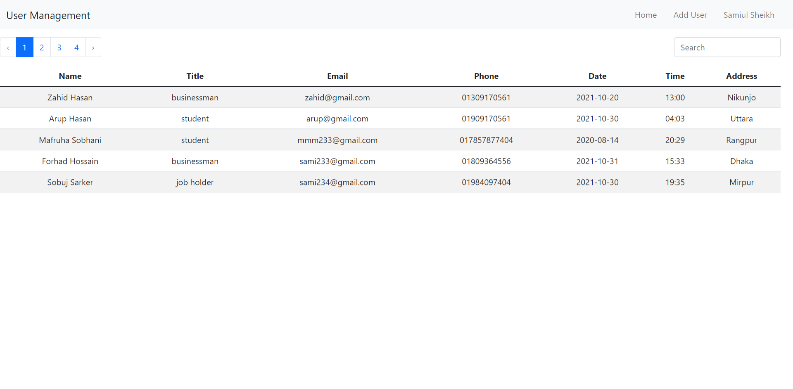
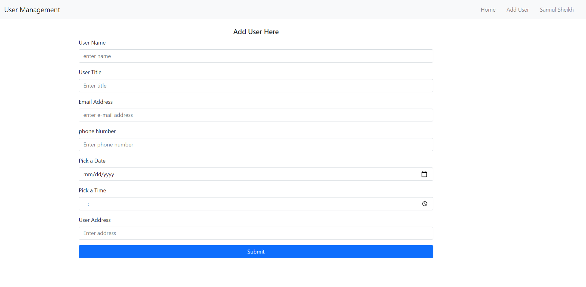

# User Management
## user management react application

### `Technology Used`
- JavaScript (ES6)
- React JS
- Node JS
- Express JS
- Mongo DB
- Bootstrap
- React Router
- React Hook
- Context API
- Firebase Authentication
- FontAwesomeIcon
---
## :link: [See live project here](https://user-management-bd.web.app/)

---
### `Project Features`
- User Management react application.
- Users can view all user information in homepage.
- Implement login system using Firebase.
- Users can search specific person by name or phone number.
- Paginated data from the database.
- An User can add new person after login.
### `Server Side Repository`
https://github.com/samiul-sheikh/user-management-server

### `Project UI`

